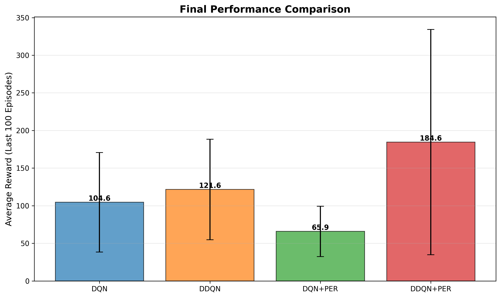
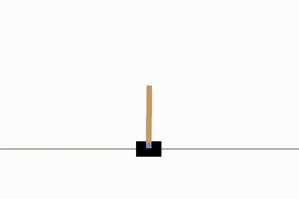
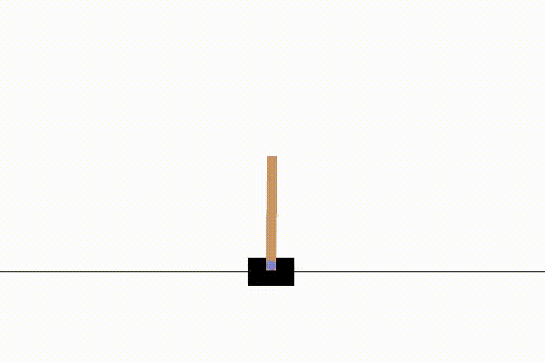

# Smarter Q-Learning Agents  
### Deep Q-Networks, Double DQN, and Prioritized Experience Replay

This project implements and evaluates several Deep Reinforcement Learning (DRL) algorithms for control tasks using the **CartPole-v1** environment from Gymnasium. The goal is to study how architectural and algorithmic improvements—such as **target networks**, **Double Q-learning**, and **Prioritized Experience Replay (PER)**—affect learning stability, convergence speed, and final policy performance.

---

## Overview

Classical Q-learning relies on tabular representations that scale poorly to large or continuous state spaces. **Deep Q-Networks (DQN)** address this limitation by approximating the action-value function with neural networks, enabling learning directly from raw state inputs.

However, vanilla DQN suffers from:
- Training instability due to moving targets  
- Overestimation bias caused by the max operator  
- Inefficient learning from uniformly sampled experiences  

This project incrementally addresses these issues through:
- Target Networks  
- Double DQN (DDQN)  
- Prioritized Experience Replay (PER)  

All methods are implemented from scratch and evaluated under identical experimental conditions.

---

## Algorithms Implemented

| Algorithm | Description |
|---------|-------------|
| **DQN** | Baseline Deep Q-Network with experience replay and target network |
| **Double DQN (DDQN)** | Decouples action selection and evaluation to reduce overestimation bias |
| **DQN + PER** | Uses prioritized replay to sample informative transitions |
| **DDQN + PER** | Combines stable value estimation with prioritized replay |

---

## Environment: CartPole-v1

- **State Space:** 4 continuous variables  
  - Cart position  
  - Cart velocity  
  - Pole angle  
  - Pole angular velocity
- **Action Space:**  
  - 0: Push cart left  
  - 1: Push cart right
- **Reward:** +1 per timestep the pole remains upright
- **Termination:**  
  - Pole angle exceeds ±12°  
  - Cart moves out of bounds  
  - Max episode length: 500 steps

---

## Results

### Training Curves


---

### Performance Comparison



---

### Key Observations

- **DQN** learns quickly but plateaus early due to overestimation bias.
- **DDQN** exhibits smoother and more stable learning dynamics.
- **DQN + PER** suffers from instability, as PER amplifies inflated TD errors.
- **DDQN + PER** achieves the best overall performance, combining stability with efficient replay, albeit with higher variance.

---

## Agent Behavior (Videos)

### DQN


### Double DQN (DDQN)


### DQN + Prioritized Experience Replay


### Double DQN + Prioritized Experience Replay


---

## Project Structure

```
.
├── agent.py
├── memory.py
├── model.py
├── main.py
├── setup_env.sh
├── results/
│   ├── training_curves.png
│   └── performance_comparison.png
├── logs/
└── README.md
```

---

## Setup Instructions

### Create Conda Environment
```bash
bash setup_env.sh
conda activate dqn_env
```

### Run Training
```bash
python main.py --run all
```

---

## Implementation Details

- Neural Network: Fully connected MLP  
- Optimizer: Adam  
- Loss Function:  
  - MSE for DQN / DDQN  
  - Importance-weighted MSE for PER  
- Replay Buffer: Uniform or Prioritized  
- Exploration: ε-greedy with decay  

--- 
