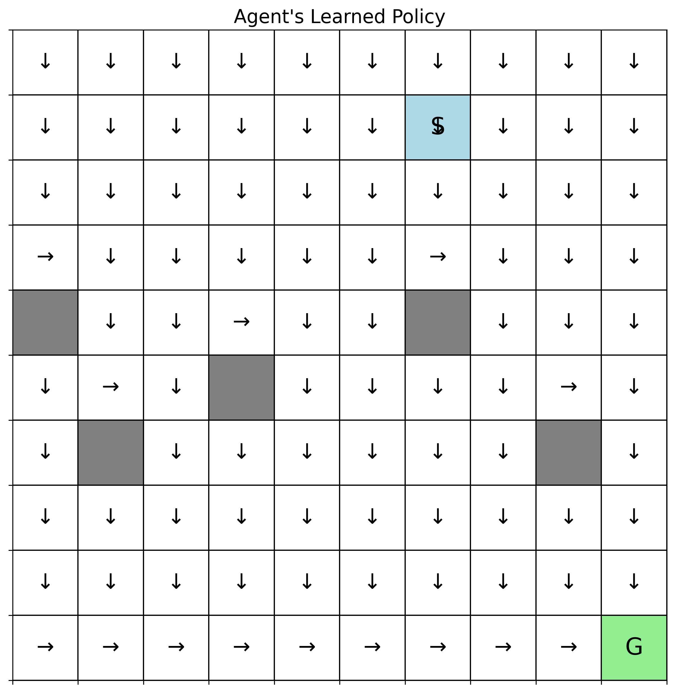

# GridWorld: Dynamic Programming for Navigation

A comprehensive implementation of classic Dynamic Programming algorithms (Value Iteration and Policy Iteration) for solving navigation problems in a GridWorld environment. This project demonstrates how model-based reinforcement learning methods can find optimal policies under various conditions including obstacles and stochastic transitions.

## Overview

The GridWorld environment simulates an agent navigating through a grid to reach a goal while avoiding obstacles. The agent must find the safest and fastest route, handling:

- **Obstacles**: Blocked cells that penalize the agent upon collision
- **Stochastic Transitions**: Simulated "slippery" conditions where actions may fail with some probability
- **Time Constraints**: Each step incurs a cost, incentivizing efficient paths

## Features

- **Value Iteration**: Finds optimal value function through iterative Bellman updates
- **Policy Iteration**: Alternates between policy evaluation and improvement until convergence
- **Configurable Environment**: Adjustable grid size, obstacles, slip probability, and reward structure
- **Visualization**: Policy visualization with directional arrows and interactive episode playback
- **Convergence Analysis**: Track learning progress and convergence behavior

## Installation

### Requirements

- Python 3.7 - 3.13
- NumPy
- Matplotlib

### Setup

```bash
# Clone the repository
git clone https://github.com/amirthalingamrajasundar/RL-Experiments.git
cd RL-Experiments/grid-world

# Install dependencies
pip install numpy matplotlib
```

## Usage

### Quick Start

```bash
python main.py
```

The script will prompt for configuration options:
1. **Seed**: Used to generate a randomized grid configuration (any integer)
2. **Obstacles**: Whether to include obstacles in the environment
3. **Stochasticity**: Whether to enable slip probability (rainy day conditions)
4. **Discount Factor (γ)**: Controls the agent's preference for immediate vs. future rewards

### Programmatic Usage

```python
from env import GridWorld
from agents import ValueIterationAgent, PolicyIterationAgent

# Create environment
env = GridWorld(
    size=10,
    start=(0, 0),
    goal=(9, 9),
    obstacles=[(3, 3), (4, 4), (5, 5)],
    stochastic=True,
    slip_prob=0.1
)

# Run Value Iteration
vi_agent = ValueIterationAgent(env, gamma=0.9, theta=1e-6)
vi_agent.solve()
vi_agent.save_policy_visualization("vi_policy.png")

# Run Policy Iteration
pi_agent = PolicyIterationAgent(env, gamma=0.9, theta=1e-6)
pi_agent.solve()
pi_agent.save_policy_visualization("pi_policy.png")
```

## Environment Details

### State Space
- 10×10 grid (configurable)
- Each cell `(row, col)` is a state

### Action Space
| Action | Direction | Movement |
|--------|-----------|----------|
| 0 | UP | row - 1 |
| 1 | DOWN | row + 1 |
| 2 | LEFT | col - 1 |
| 3 | RIGHT | col + 1 |

### Reward Structure
| Event | Reward |
|-------|--------|
| Each step | -1 |
| Hitting obstacle | -10 |
| Reaching goal | 0 (terminal) |

### Transition Dynamics
- **Deterministic**: Agent moves in intended direction (unless blocked)
- **Stochastic**: With probability `slip_prob`, agent takes a random action instead

## Algorithms

### Value Iteration

Iteratively applies the Bellman Optimality Equation until convergence:

```
V(s) = max_a Σ P(s'|s,a) [R(s,a,s') + γV(s')]
```

The algorithm:
1. Initialize value function V(s) = 0 for all states
2. For each state, compute max Q-value across all actions
3. Repeat until max change (δ) < θ
4. Extract greedy policy from converged value function

### Policy Iteration

Alternates between evaluation and improvement:

**Policy Evaluation:**
```
Vπ(s) = Σ P(s'|s,π(s)) [R(s,π(s),s') + γVπ(s')]
```

**Policy Improvement:**
```
π'(s) = argmax_a Σ P(s'|s,a) [R(s,a,s') + γVπ(s')]
```

The algorithm:
1. Initialize arbitrary policy
2. **Evaluate**: Compute value function for current policy
3. **Improve**: Update policy greedily w.r.t. value function
4. Repeat until policy stabilizes

## Experimental Results

### Effect of Discount Factor (γ)

| γ | Convergence Speed | Policy Quality |
|---|-------------------|----------------|
| 0.9 | Moderate | Optimal |
| 0.7 | Moderate | Optimal |
| 0.5 | Faster | Optimal |
| 0.3 | Fast | Near-optimal |
| 0.1 | Fastest | May be suboptimal |

**Key Findings:**
- Lower γ leads to faster convergence but can result in myopic, suboptimal policies
- Higher γ ensures long-term optimal behavior but requires more iterations
- Policy Iteration is more robust to low γ values than Value Iteration

### Impact of Obstacles

- Both algorithms successfully navigate around obstacles
- No significant change in convergence speed compared to obstacle-free environments
- Policies adapt to find shortest paths while avoiding penalties

### Stochastic Environments (Slip Probability)

| Slip Prob | θ | VI Iterations | PI Iterations |
|-----------|------|---------------|---------------|
| 0.0001 | 1e-6 | 21 | 10 |
| 0.001 | 1e-6 | 92 | 235 |
| 0.01 | 1e-3 | 229 | 9 |

**Key Findings:**
- Higher slip probability significantly slows convergence
- Value Iteration tends to be more stable under uncertainty
- Policy Iteration may oscillate; tuning θ improves convergence
- For high stochasticity, relaxing convergence threshold (higher θ) may be necessary

## Project Structure

```
grid-world/
├── README.md           # This file
├── env.py              # GridWorld environment implementation
├── agents.py           # Value Iteration & Policy Iteration agents
├── main.py             # Main execution script
├── random_oracle_*.pyc # Grid configuration generators
└── results/            # Saved policy visualizations
    ├── stage_1/        # Deterministic, no obstacles
    ├── stage_2/        # Deterministic with obstacles
    └── stage_3/        # Stochastic with obstacles
```

## Key Parameters

| Parameter | Description | Default |
|-----------|-------------|---------|
| `size` | Grid dimensions (N×N) | 10 |
| `gamma` | Discount factor [0,1] | 0.9 |
| `theta` | Convergence threshold | 1e-6 |
| `slip_prob` | Action failure probability | 0.1 |
| `step_reward` | Reward per step | -1.0 |
| `obstacle_penalty` | Penalty for obstacle collision | -10.0 |

## Visualization

The project generates policy visualizations showing:
- **S**: Start position (light blue)
- **G**: Goal position (light green)
- **Grey cells**: Obstacles
- **Arrows (↑↓←→)**: Optimal action for each state

### Sample Learned Policies

#### Deterministic Environment (No Obstacles)

| Value Iteration (γ=0.9) | Policy Iteration (γ=0.9) |
|:-----------------------:|:------------------------:|
|  |  |

#### Deterministic Environment with Obstacles

| Value Iteration (γ=0.9) | Policy Iteration (γ=0.9) |
|:-----------------------:|:------------------------:|
|  |  |

#### Stochastic Environment (slip_prob=0.001)

| Value Iteration | Policy Iteration |
|:-----------------------:|:------------------------:|
|  |  |
